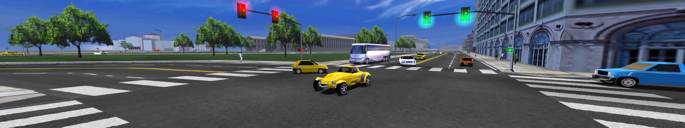

# Open1560

Open1560 is an open source re-implementation of Midtown Madness Sneak Preview Beta / Build 1560.

This project is a bottom-up rewrite of Midtown Madness 1, using the original binary to provide functions that have not been implemented yet. 
The intention is to allow the fixing of bugs, implementation of new features and porting to platforms unsupported by the original. 

## Installation
1. Download and install the [Visual C++ 2019 Redistributable](https://aka.ms/vs/16/release/vc_redist.x86.exe).
2. Download the [Latest Version](https://ci.appveyor.com/api/projects/0x1F9F1/Open1560/artifacts/build/Open1560.zip?branch=master) and extract the files directly into your MM1 directory (retail or beta).
3. Read `Open1560-README.txt`
4. To play, run `Open1560.exe`

## FAQ
* Do I need to install the XP patch?
    * No, Open1560 works with or without the XP patch.
* Do I need to install dgVoodoo2?
    * No, Open1560 uses an OpenGL 3 renderer.

## Support
If you are having problems or wish to report a bug, [join the discord](https://discord.gg/HHZz27sFEH) or [create an issue](https://github.com/0x1F9F1/Open1560/issues/new)

## Changes
Current changes include:
* OpenGL Renderer
* Audio Fixes
* Crash Fixes
* Input Fixes
* Stuttering Fixes
* Improved Debug Menu
* Improved Performance
* Improved/Fixed Text Rendering
